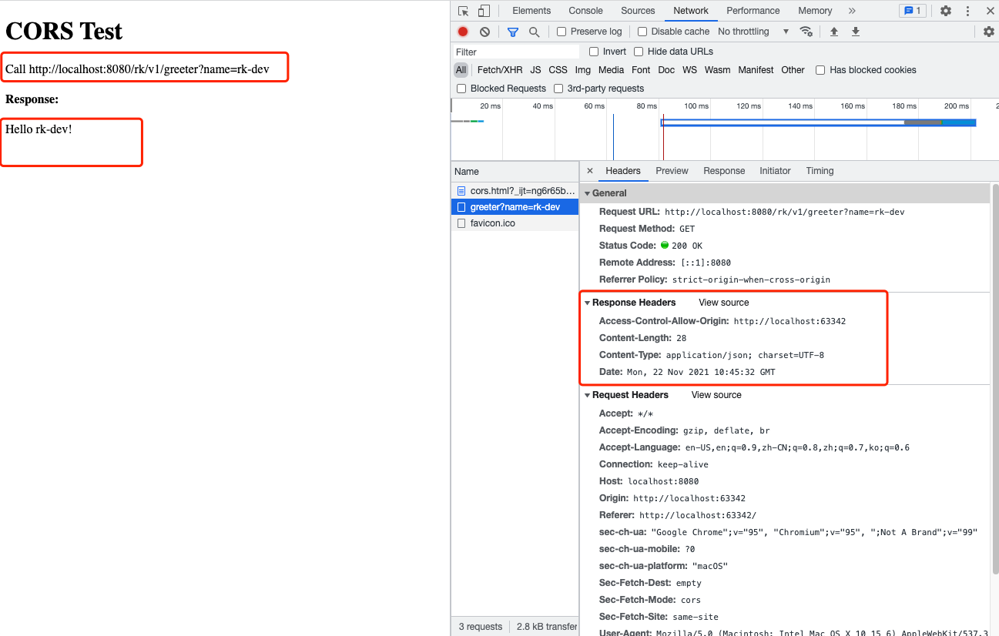
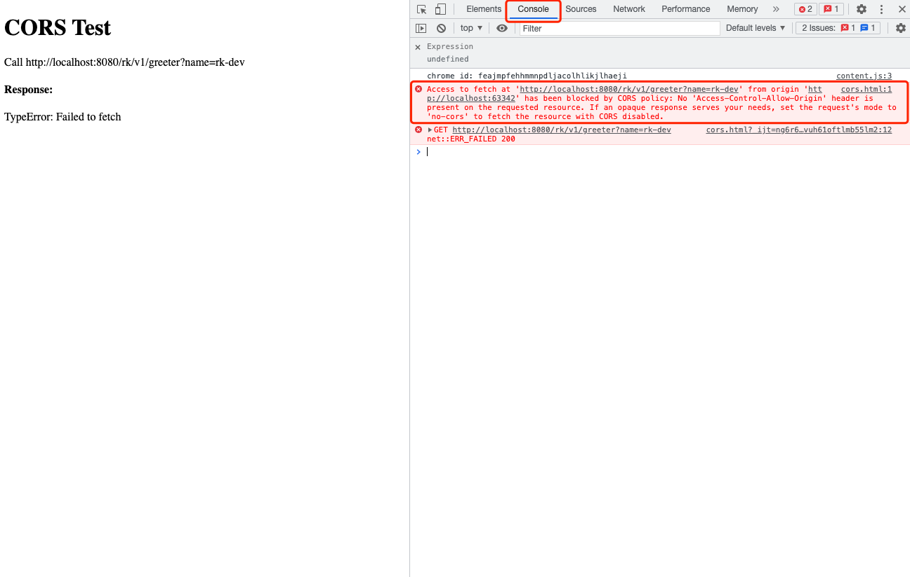

# CORS middleware
In this example, we will try to create gin server with cors middleware enabled.

<!-- START doctoc generated TOC please keep comment here to allow auto update -->
<!-- DON'T EDIT THIS SECTION, INSTEAD RE-RUN doctoc TO UPDATE -->
**Table of Contents**  *generated with [DocToc](https://github.com/thlorenz/doctoc)*

- [Quick start](#quick-start)
  - [Code](#code)
- [Options](#options)
- [Example](#example)
  - [With accept CORS for all domains](#with-accept-cors-for-all-domains)
  - [With accept CORS with domain not allowed](#with-accept-cors-with-domain-not-allowed)
  - [With accept CORS with domain allowed](#with-accept-cors-with-domain-allowed)
  - [Code](#code-1)

<!-- END doctoc generated TOC please keep comment here to allow auto update -->

## Quick start
Get rk-gin package from the remote repository.

```go
go get -u github.com/rookie-ninja/rk-gin
```

### Code
Add rkgincors.Interceptor() CORS with option.

```go
    // ********************************************
    // ********** Enable interceptors *************
    // ********************************************
	interceptors := []gin.HandlerFunc{
        rkgincors.Interceptor(),
    }
```

## Options

| Name | Description | Default Values |
| ---- | ---- | ---- |
| rkmidcors.WithEntryNameAndType(entryName, entryType string) | Provide entry name and type if there are multiple CORS interceptors needs to be used. | gin, gin |
| rkmidcors.WithIgnorePrefix(string...) | Provide path to ignore | [] |
| rkmidcors.WithAllowOrigins(string...) | Provide allowed origins with wildcard enabled | * |
| rkmidcors.WithAllowMethods(string...) | Provide allowed methods returns as response header of OPTIONS request | All http methods |
| rkmidcors.WithAllowHeaders(string...) | Provide allowed headers returns as response header of OPTIONS request | Headers from request |
| rkmidcors.WithAllowCredentials(bool) | Returns as response header of OPTIONS request | false |
| rkmidcors.WithExposeHeaders(string...) | Provide exposed headers returns as response header of OPTIONS request | "" |
| rkmidcors.WithMaxAge(int) | Provide max age returns as response header of OPTIONS request | 0 |

## Example
### With accept CORS for all domains
In this example, we will enable CORS middleware without any options.

In this case, all the requests from any Origin is acceptable.

```go
	// ********************************************
	// ********** Enable interceptors *************
	// ********************************************
	interceptors := []gin.HandlerFunc{
		rkgincors.Interceptor(),
	}
```

Access [cors.html](cors.html), we will be able to access API.



With OPTIONS request, related CORS headers would be returned.

```shell script
curl -vs -X OPTIONS "localhost:8080/rk/v1/greeter?name=rk-dev" -H "Origin: http://test.domain"
*   Trying ::1...
* TCP_NODELAY set
* Connected to localhost (::1) port 8080 (#0)
> OPTIONS /rk/v1/greeter?name=rk-dev HTTP/1.1
> Host: localhost:8080
> User-Agent: curl/7.64.1
> Accept: */*
> Origin: http://test.domain
> 
< HTTP/1.1 204 No Content
< Access-Control-Allow-Methods: GET,HEAD,PUT,PATCH,POST,DELETE
< Access-Control-Allow-Origin: http://test.domain
< Vary: Access-Control-Request-Method
< Vary: Access-Control-Request-Headers
< Date: Mon, 22 Nov 2021 14:35:58 GMT
```

### With accept CORS with domain not allowed
In this example, we will enable CORS middleware with rkgincors.WithAllowOrigins("http://localhost:8080")

```go
	// ********************************************
	// ********** Enable interceptors *************
	// ********************************************
	interceptors := []gin.HandlerFunc{
		rkgincors.Interceptor(
			// Bellow section is for CORS policy.
			// Please refer https://developer.mozilla.org/en-US/docs/Web/HTTP/CORS for details.
			// Provide allowed origins
			rkmidcors.WithAllowOrigins("http://localhost:8080"),
        ),
	}
```

Access [cors.html](cors.html), we will not be able to access API since the Origin is not http://localhost:8080.



### With accept CORS with domain allowed
In this example, we will enable CORS middleware with rkgincors.WithAllowOrigins("http://localhost:*")

```go
	// ********************************************
	// ********** Enable interceptors *************
	// ********************************************
	interceptors := []gin.HandlerFunc{
		rkgincors.Interceptor(
			// Bellow section is for CORS policy.
			// Please refer https://developer.mozilla.org/en-US/docs/Web/HTTP/CORS for details.
			// Provide allowed origins
			rkgincors.WithAllowOrigins("http://localhost:*"),
        ),
	}
```

Access [cors.html](cors.html), we will be able to access API.


### Code
- [greeter-server.go](greeter-server.go)
