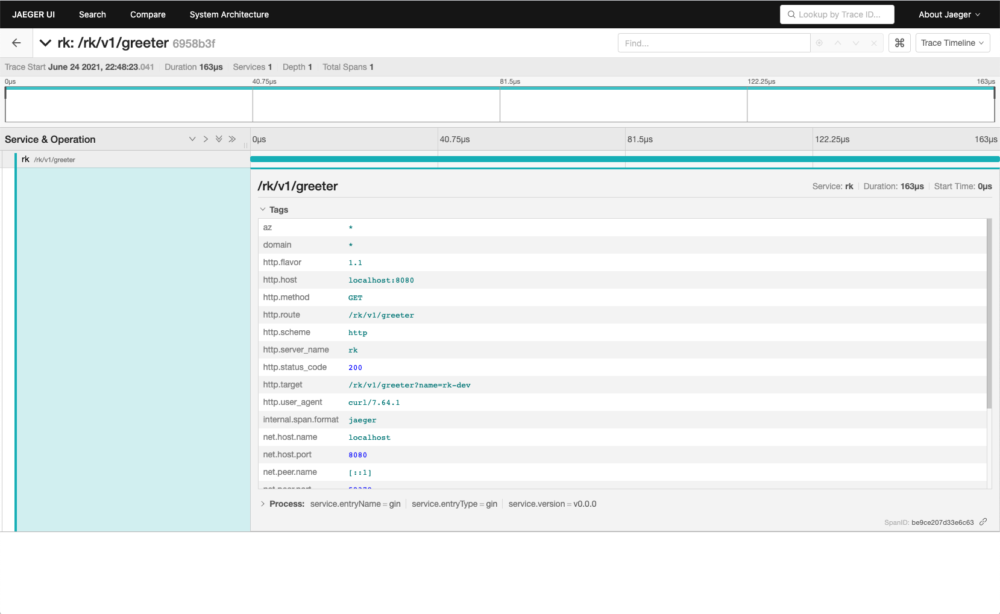

# Trace interceptor
In this example, we will try to create gin server with trace interceptor enabled.

Trace interceptor has bellow options currently while exporting tracing information.

| Exporter | Description |
| ---- | ---- |
| Stdout | Export as JSON style. |
| Local file | Export as JSON style. |
| Jaeger | Export to jaeger collector or agent. |

**Please make sure panic interceptor to be added at last in chain of interceptors.**

<!-- START doctoc generated TOC please keep comment here to allow auto update -->
<!-- DON'T EDIT THIS SECTION, INSTEAD RE-RUN doctoc TO UPDATE -->
**Table of Contents**  *generated with [DocToc](https://github.com/thlorenz/doctoc)*

- [Quick start](#quick-start)
- [Options](#options)
  - [Exporter](#exporter)
    - [Stdout exporter](#stdout-exporter)
    - [File exporter](#file-exporter)
    - [Jaeger exporter](#jaeger-exporter)
- [Example](#example)
  - [Start server and client](#start-server-and-client)
  - [Output](#output)
    - [Stdout exporter](#stdout-exporter-1)
    - [Jaeger exporter](#jaeger-exporter-1)
  - [Code](#code)

<!-- END doctoc generated TOC please keep comment here to allow auto update -->

## Quick start
Get rk-gin package from the remote repository.

```go
go get -u github.com/rookie-ninja/rk-gin
```
```go
    // ********************************************
    // ********** Enable interceptors *************
    // ********************************************
    interceptors := []gin.HandlerFunc{
        rkgintrace.Interceptor(
            // Entry name and entry type will be used for distinguishing interceptors. Recommended.
            // rkgintrace.WithEntryNameAndType("greeter", "gin"),
            //
            // Provide an exporter.
            // rkgintrace.WithExporter(exporter),
            //
            // Provide propagation.TextMapPropagator
            // rkgintrace.WithPropagator(<propagator>),
            //
            // Provide SpanProcessor
            // rkgintrace.WithSpanProcessor(<span processor>),
            //
            // Provide TracerProvider
            // rkgintrace.WithTracerProvider(<trace provider>),
        ),
    }
```

## Options
If client didn't enable trace interceptor, then server will create a new trace span by itself. If client sends a tracemeta to server, 
then server will use the same traceId.

| Name | Description | Default |
| ---- | ---- | ---- |
| WithEntryNameAndType(entryName, entryType string) | Provide entryName and entryType, recommended. | entryName=gin, entryType=gin |
| WithExporter(exporter sdktrace.SpanExporter) | User defined exporter. | [Stdout exporter](https://pkg.go.dev/go.opentelemetry.io/otel/exporters/stdout) with pretty print and disabled metrics |
| WithSpanProcessor(processor sdktrace.SpanProcessor) | User defined span processor. | [NewBatchSpanProcessor](https://pkg.go.dev/go.opentelemetry.io/otel/sdk/trace#NewBatchSpanProcessor) |
| WithPropagator(propagator propagation.TextMapPropagator) | User defined propagator. | [NewCompositeTextMapPropagator](https://pkg.go.dev/go.opentelemetry.io/otel/propagation#TextMapPropagator) |


### Exporter
#### Stdout exporter
```go
    // ****************************************
    // ********** Create Exporter *************
    // ****************************************

    // Export trace to stdout with utility function
    //
    // Bellow function would be while creation
    // set.Exporter, _ = stdout.NewExporter(
    //     stdout.WithPrettyPrint(),
    //     stdout.WithoutMetricExport())
    exporter := rkgintrace.CreateFileExporter("stdout")

    // Users can define own stdout exporter by themselves.
	exporter, _ := stdouttrace.New(stdouttrace.WithPrettyPrint())
```

#### File exporter
```go
    // ****************************************
    // ********** Create Exporter *************
    // ****************************************

    // Export trace to local file system
    exporter := rkgintrace.CreateFileExporter("logs/trace.log")
```

#### Jaeger exporter
```go
    // ****************************************
    // ********** Create Exporter *************
    // ****************************************

	// Export trace to jaeger agent
	exporter := rkgintrace.CreateJaegerExporter(jaeger.WithAgentEndpoint())
```

## Example
### Start server and client
```shell script
$ go run greeter-server.go
```

### Output
#### Stdout exporter
If logger interceptor enabled, then traceId would be attached to event and zap logger.

- Server side trace log
```shell script
[
        {
                "SpanContext": {
                        "TraceID": "741da697901cc44883d9e78939f3af5d",
                        "SpanID": "725dcabd5778dca5",
                        "TraceFlags": "01",
                        "TraceState": null,
                        "Remote": false
                },
                ...
```

- Server side log (zap & event)
```shell script
2021-06-24T22:46:16.564+0800    INFO    tracing/greeter-server.go:91    Received request from client.   {"traceId": "741da697901cc44883d9e78939f3af5d"}
```
```shell script
------------------------------------------------------------------------
endTime=2021-06-24T22:46:16.564459+08:00
startTime=2021-06-24T22:46:16.564237+08:00
elapsedNano=221598
timezone=CST
ids={"eventId":"25931bf9-c218-4f2f-893b-607fe60eb39c","traceId":"741da697901cc44883d9e78939f3af5d"}
app={"appName":"rk","appVersion":"v0.0.0","entryName":"gin","entryType":"gin"}
env={"arch":"amd64","az":"*","domain":"*","hostname":"lark.local","localIP":"10.8.0.2","os":"darwin","realm":"*","region":"*"}
payloads={"apiMethod":"GET","apiPath":"/rk/v1/greeter","apiProtocol":"HTTP/1.1","apiQuery":"name=rk-dev","userAgent":"curl/7.64.1"}
error={}
counters={}
pairs={}
timing={}
remoteAddr=localhost:51856
operation=/rk/v1/greeter
resCode=200
eventStatus=Ended
EOE
```

- Client side
```shell script
$ curl -vs "localhost:8080/rk/v1/greeter?name=rk-dev"
...
< X-Trace-Id: 741da697901cc44883d9e78939f3af5d
```

#### Jaeger exporter


### Code
- [greeter-server.go](greeter-server.go)
